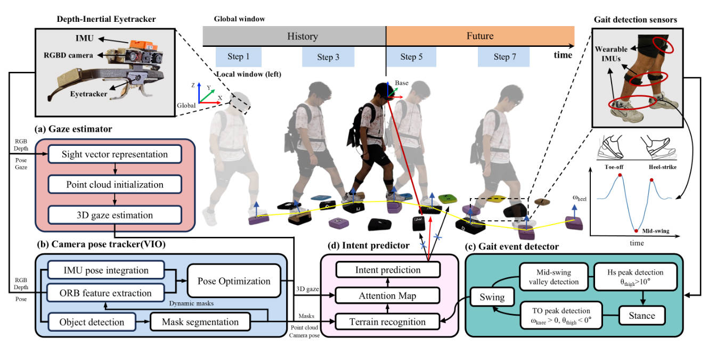

# Gaze-based Prosthesis Control

This project proposes a gaze-based control framework for powered prostheses.

<kbd>
  
</kbd>

## 1. Hardware

- **Eye tracker:** Tobbi Pro Glasses 2 (50 Hz)
- **Depth camera:** Orbbec Astra Mini Pro (640×480 @ 30fps)
- **IMUs:** Xsens MTI630 (200Hz), im948 (bluetooth, 200Hz)
- **CPU & GPU:** Intel Core i7-12700H & NVIDIA GeForce RTX 3060

## 2. Overview

This package contains ROS nodes for:

- IMU data processing (`imu/pose_publisher.py`)
- Environment perception (`env_perception/fpp_node.py`)
- Gaze tracking device (`gaze_publisher.py`)
- Prosthesis control (`main_control.py`)

This project still need:

- Camera launcher (ROS node that publish images)
- Pose estimator (Vision-inertial Odometry)

Overall, The whole project can be divided into two parts: the foot placement predictor (finished) and the prosthetic controller (TODO). In the proposed paper, we employed ORB-slam3 for camera pose estimation, and it presented as a ROS node that publish pose message. The user should implement their own odometry algorithm, IMU and camera devices to run this project.

---

## 3. Dependencies

It is built for Ubuntu 20.04 + ROS Noetic:

- ROS Noetic (roscpp, rospy, std_msgs, sensor_msgs, geometry_msgs)
- Open3D for point cloud processing (`pip install open3d`)
- Python 3.8

---

## 4. Installation & Build

```bash
# Setup the workspace
cd ~/catkin_ws/src
git clone git@github.com:czk-0825/GPC.git
cd ..
catkin_make
source devel/setup.bash

# Run the devices (Optional)
rosrun gaze_pros_control gaze_publisher.py
roslaunch astra_camera astra.launch
roslaunch gaze_pros_control Xsens_driver.launch

# Run the perdictor/gait event detector
rosrun gaze_pros_control fpp_node.py
rosrun gaze_pros_control multi_imu_rec.py

```
## 5. Related Publications

[1] Chen X, Chen Z, Wang Y, et al. A Gaze-Guided Human Locomotion Intention Recognition and Volitional Control Method for Knee-Ankle Prostheses[J]. IEEE Transactions on Cognitive and Developmental Systems, 2025.
[2] Chen Z, Xu H, Chen X, et al. A Human Vision-aided Method for Foot Placement Prediction on Rough Terrains. (Under review)
